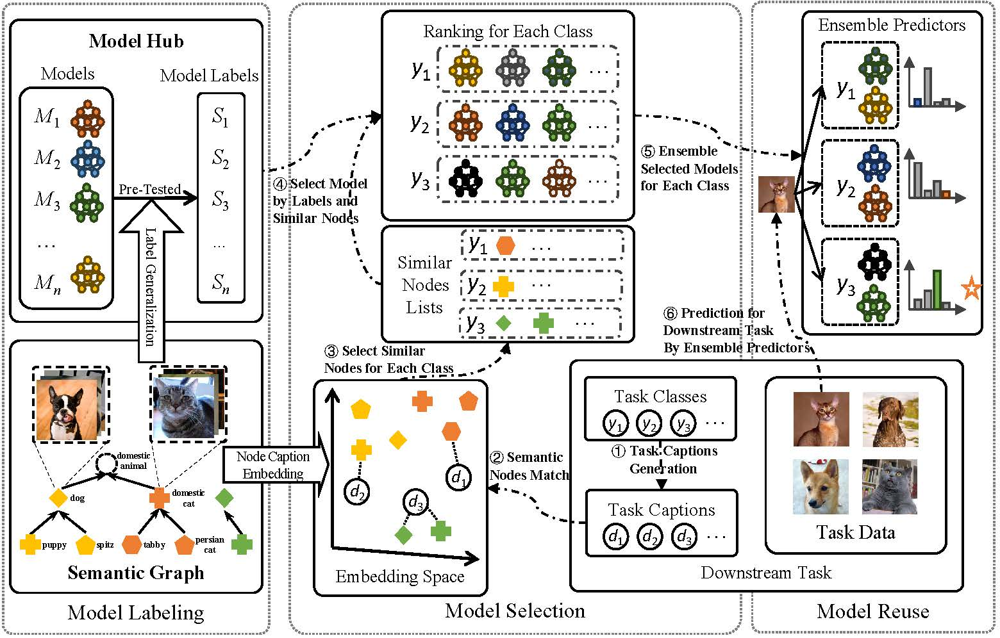

# [ICML'25] Vision-Language Model Selection and Reuse for Downstream Adaptation
[[`Paper`](https://arxiv.org/abs/2501.18271)] [[`Code`](https://github.com/LAMDASZ-ML/MLL)]

## 🖥️ Introduction
Vision-Language Models (VLMs) are becoming increasingly popular across various visual tasks, and several open-sourced VLM variants have been released. However, selecting the best-performing  VLM for a specific downstream task is challenging since no single VLM can achieve promising performance on all downstream tasks, and evaluating all available VLMs is impossible due to time and data limitations. To address this problem, we proposes a novel paradigm to select and reuse VLM for downstream adaptation, called **M**odel **L**abel **L**earning **(MLL)**.
### MLL Paradigm

**MLL** contains three key modules: *model labeling*, which assigns labels to each
VLM to describe their specialty and utility; *model selection*, which matches the requirements of the target task with model labels; and *model reuse*, which applies selected VLMs to the target task in an ensemble manner. The proposal is highly computationally efficient and growable. We also introduce a new benchmark for evaluating VLM selection methods, including 49 VLMs and 17 target task datasets.

## 📢 News
- [2025-05] Our paper has been accepted by ICML 2025!
- [2025-05] Our [code](https://github.com/LAMDASZ-ML/MLL) for MLL is released now.
- [2025-01] Our [paper](https://arxiv.org/abs/2501.18271) is accessible now.


## 📦 Installation
### Prepare environment

Prepare your conda environment with `environment.yml`.

```bash
$ conda env create -f environment.yml
```
### Prepare Datasets

#### Target Datasets and Sample Datasets
We have listed all needed datasets in the json file `./MLL/dataset.json`. You can download them from source websites of each datasets and put them to specific paths as shown in the attribute `'root'` of each dataset. Here are the download links of them.

| Datasets          | Link                                                         |
| ------------------- | ------------------------------------------------------------ |
| ImageNet      | https://image-net.org/download.php             |
| ImageNet-V2  | https://huggingface.co/datasets/vaishaal/ImageNetV2/resolve/main/imagenetv2-matched-frequency.tar.gz?download=true     |
| ImageNet-Sketch | https://huggingface.co/datasets/songweig/imagenet_sketch/resolve/main/data/ImageNet-Sketch.zip?download=true     |
| ImageNet-A  | https://people.eecs.berkeley.edu/~hendrycks/imagenet-a.tar     |
| ImageNet-R | https://people.eecs.berkeley.edu/~hendrycks/imagenet-r.tar |
| CIFAR100  | https://www.cs.toronto.edu/%7Ekriz/cifar-100-python.tar.gz           |
| Country211  | https://openaipublic.azureedge.net/clip/data/country211.tgz     |
| CLEVR-D  | https://huggingface.co/datasets/djghosh/wds_vtab-clevr_closest_object_distance_test/tree/main      |
| DTD                | https://www.robots.ox.ac.uk/~vgg/data/dtd/download/dtd-r1.0.1.tar.gz             |
| DMLab     | https://huggingface.co/datasets/djghosh/wds_vtab-dmlab_test/tree/main              |
| Flowers102      | https://www.robots.ox.ac.uk/~vgg/data/flowers/102/102flowers.tgz               |
| FER2013  | https://www.kaggle.com/datasets/msambare/fer2013      |
| Food101          | http://data.vision.ee.ethz.ch/cvl/food-101.tar.gz                 |
| GTSRB  | http://benchmark.ini.rub.de/Dataset/GTSRB_Python_code.zip              |
| MNIST  | https://yann.lecun.com/exdb/mnist/t10k-images-idx3-ubyte.gz               |
| OxfordIIITPet  | https://thor.robots.ox.ac.uk/~vgg/data/pets/images.tar.gz          |
| PCam  | https://github.com/basveeling/pcam             |
| Rendered SST2  |  https://openaipublic.azureedge.net/clip/data/rendered-sst2.tgz    |
| RESISC45  | https://1drv.ms/u/s!AmgKYzARBl5ca3HNaHIlzp_IXjs           |
| StanfordCars  | https://huggingface.co/datasets/djghosh/wds_cars_test/tree/main                |
| STL10  | http://ai.stanford.edu/~acoates/stl10/stl10_binary.tar.gz             |
| UCF101           | https://drive.google.com/file/d/10Jqome3vtUA2keJkNanAiFpgbyC9Hc2O/view?usp=sharing                |


#### Evaluation Datasets for MLL
 You can download evaluation datasets `evaluation_datasets.tar.gz` from [here](https://pan.baidu.com/s/1UfCpXTtkCxIAtxGr4xnmLw?pwd=gp1q) and unzip it to `./evaluation_dataset`. You can also construct it from scratch by runing the code.
```bash
$ python ./MLL/evaluation_dataset_construct.py
```
## 🔥 Usage
### Build model labels

```bash
$ python ./MLL/label.py
```

### Select models

```bash
$ python selection.py
```

### Reuse models

```bash
$ python reuse.py
```

The results will be stored in `./MLL/res/reuse`

## 📜 Citation

If you find our work useful, please consider citing:

```bibtex
@article{tan2025vision,
  title={Vision-Language Model Selection and Reuse for Downstream Adaptation},
  author={Tan, Hao-Zhe and Zhou, Zhi and Li, Yu-Feng and Guo, Lan-Zhe},
  journal={arXiv preprint arXiv:2501.18271},
  year={2025}
}
```